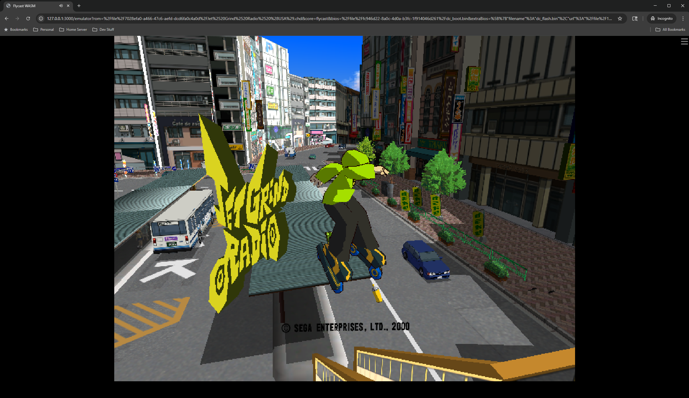

# Flycast WASM

**The first Sega Dreamcast emulator that runs in a browser, powered by the
first SH4 to WebAssembly JIT recompiler. Native performance.**

<p align="center">
  
  
  
</p>

This repository contains a working WebAssembly build of
[flyinghead/flycast](https://github.com/flyinghead/flycast) as a libretro core,
plus the custom dynamic recompiler that makes it fast. Download the core, load
it in an EmulatorJS-style frontend with your own legally dumped BIOS and game
images, and Dreamcast games run in a browser tab. Heavy 3D titles hold a locked
60fps with clean audio.

Nobody had done this before. The upstream maintainer
[explicitly declined WASM support](https://github.com/flyinghead/flycast/issues/1883).
EmulatorJS doesn't list Dreamcast as a supported system. The libretro buildbot
produces no Flycast WASM core. The received wisdom was that a fast Dreamcast in
the browser wasn't possible, because WebAssembly forbids the self-modifying
code that every dynarec depends on. Turns out it is possible. This is it.

## What was built

- **The port** (February 2026): upstream flycast compiled to WebAssembly with
  Emscripten and CMake, running as a libretro core with WebGL2 rendering. On
  the interpreter it booted and played at a couple of FPS. Proof of life, not
  a product.
- **The JIT** (March through August 2026): a from-scratch SH4 to WASM dynamic
  recompiler. SH4 machine code is decoded to Flycast's SHIL IR, compiled to
  WebAssembly bytecode in the browser at runtime, instantiated via
  `WebAssembly.compile`, and dispatched through `call_indirect` from a C
  dispatch loop. No JavaScript in the hot path. 62 of 70 SHIL ops emit native
  wasm. Registers are cached in wasm locals. Hot code gets fused into
  multi-block modules.
- **The hard parts**: self-modifying-code detection via page generations
  (eliminated 98% of runtime hashing), inline fast paths for guest memory
  access (import crossings cut from roughly 500K per frame to 9K, which was
  the single biggest wall), a guest-time-debt frame pacer, compile storm
  management, and an AudioWorklet ring with tempo-based rate control.
- **The validation methodology**: every subsystem was certified against the
  unmodified reference interpreter through differential test harnesses.
  Hundreds of thousands of block-level comparisons at zero divergence, instead
  of playing games and hoping. If you ever want to build a correct JIT solo,
  this methodology is probably the most reusable thing here.
- **The result**: from about 2 FPS to a locked 60fps at native resolution with
  clean audio in the heaviest titles tested.

## What this adds

Beyond the core and the JIT, this repository ships a complete, reproducible
ecosystem so anyone can run Dreamcast games in a browser without compiling:

- **Local web server** (`server.js`, pure Node.js, zero dependencies):
  - **Automatic ROM detection** — scans `frontend/roms/` and parses `.cue` /
    `.gdi` files to know their tracks; supports `.chd`, `.zip` (with a `.gdi`
    + tracks), `.cue` and `.gdi`. The menu shows every game with no setup.
  - **Automatic BIOS detection** — reports which BIOS files are present and
    which are missing (`dc_boot.bin`, `dc_flash.bin`, optional
    `dc_nvmem.bin`), so the launcher can warn the user before starting.
  - **Core cache-busting** — `/api/roms` returns a `coreVersion` hash of the
    core `.data` so browsers never serve a stale core after an update.
  - **Cross-origin isolation headers** (COOP/COEP) required by the WASM core
    (SharedArrayBuffer) — a plain static server will not work.
  - **Cross-platform** — runs on Windows (no WSL needed), Windows+WSL and
    Linux; uses only Node.js APIs and resolves paths per OS automatically.
- **Launcher page** (`test-flycast.html`): game menu, BIOS and track
  injection into the core's file system, and a live **FPS + resolution
  overlay**.
- **Reproducible build recipe**: `build-ejs-ra.sh` (EmulatorJS RetroArch
  objects with the exact flags), `build-prod.sh` (bitcode objects for the
  `-flto` link), `build-release.sh` (core → 7z data → end-user zip pipeline)
  and `docs/BUILDING.md` (the rationale behind every flag).
- **End-user release packaging**: a self-contained zip ready for
  non-developers — see the next section.

### Lo que añade este proyecto

Más allá del core y el JIT, este repositorio incluye un ecosistema completo y
reproducible para que cualquiera pueda jugar a Dreamcast en el navegador sin
compilar:

- **Servidor web local** (`server.js`, Node.js puro, cero dependencias):
  - **Detección automática de ROMs** — escanea `frontend/roms/` y analiza los
    ficheros `.cue`/`.gdi` para conocer sus pistas; soporta `.chd`, `.zip`
    (con `.gdi` + pistas), `.cue` y `.gdi`. El menú muestra todos los juegos
    sin configuración.
  - **Detección automática de BIOS** — indica qué BIOS hay presentes y cuáles
    faltan (`dc_boot.bin`, `dc_flash.bin`, opcional `dc_nvmem.bin`), para que
    el lanzador avise al usuario antes de empezar.
  - **Cache-busting del core** — `/api/roms` devuelve un hash `coreVersion`
    del `.data` del core para que el navegador nunca sirva un core obsoleto
    tras una actualización.
  - **Cabeceras de aislamiento de origen cruzado** (COOP/COEP) que el core
    WASM necesita (SharedArrayBuffer) — un servidor estático simple no sirve.
  - **Multiplataforma** — funciona en Windows (sin WSL), Windows+WSL y Linux;
    usa solo APIs de Node.js y resuelve rutas según el sistema operativo.
- **Página de lanzamiento** (`test-flycast.html`): menú de juegos, inyección
  de BIOS y pistas en el sistema de ficheros del core, y un **overlay en vivo
  de FPS + resolución**.
- **Receta de compilación reproducible**: `build-ejs-ra.sh` (objetos de
  EmulatorJS RetroArch con las flags exactas), `build-prod.sh` (objetos
  bitcode para el enlazado con `-flto`), `build-release.sh` (tubería core →
  datos 7z → zip final) y `docs/BUILDING.md` (la razón de cada flag).
- **Empaquetado de release para usuarios finales**: un zip autocontenido
  listo para no desarrolladores — ver la siguiente sección.

## How it works

```
SH4 machine code -> Flycast decoder -> SHIL IR -> wasm bytecode emitter
        -> WebAssembly.compile -> function table -> call_indirect dispatch
                     (C dispatch loop, no JS in the hot path)
```

The full story lives in **[TECHNICAL_WRITEUP.md](TECHNICAL_WRITEUP.md)**:
architecture, every performance wall in the order it fell, the measured
numbers, and the differential validation methodology. If you're here to learn
how to build one of these, start there.

## Using the core

The release ships the built core (`flycast_libretro.js` plus `.wasm`) and its
configuration. It runs in any EmulatorJS-style libretro web frontend:

1. Serve the core files alongside your frontend. The server must send
   cross-origin isolation headers (`Cross-Origin-Opener-Policy: same-origin`
   and `Cross-Origin-Embedder-Policy: require-corp`).
2. Register the core with your frontend. See `config/core.json` for the
   metadata and `config/dreamcast-core-options.json` for the tuned core
   options.
3. Supply your own legally dumped Dreamcast BIOS (`dc_boot.bin`,
   `dc_flash.bin`) and game images (CHD, CDI, GDI, or CUE). No BIOS or game
   content is included or hosted here, and none ever will be. This project is
   the emulator, nothing else.

## Releases — end-user package

**The file to upload as a GitHub Release is `flycast-wasm-release.zip`**,
generated with `bash build-release.sh`. It is a self-contained, ready-to-play
package for non-developers: no compilation, no configuration. It contains
only what is needed to run the emulator:

- `server.js` + `package.json` — run with `npm start` (or `node server.js`)
- `frontend/bios/` and `frontend/roms/` — empty folders with instructions;
  this is where users drop their own legal BIOS and game files
- `frontend/data/` — the EmulatorJS frontend (loader, emulator, the two
  cores `flycast-wasm.data` + `flycast-legacy-wasm.data`, compression and
  localization)
- `test-flycast.html` — the launcher page
- `README.md`, `CREDITS.md`, `LICENSE` (bilingual: English first, Spanish at
  the end)

**To play in three steps:**

1. Unzip `flycast-wasm-release.zip` anywhere (Windows, macOS or Linux).
2. Copy your BIOS (`dc_boot.bin`, `dc_flash.bin`, optional `dc_nvmem.bin`)
   into `frontend/bios/` and your games (`.chd` recommended, or `.zip`,
   `.cue`, `.gdi` with their tracks) into `frontend/roms/`.
3. Run `npm start` and open `http://localhost:3333/` in your browser.

The server does the rest automatically: it detects the BIOS present and the
missing files, lists every game it finds (parsing `.cue`/`.gdi` tracks so
multi-file games work), cache-busts the core on every update, sends the
cross-origin isolation headers the WASM core requires, and shows a live
**FPS + resolution overlay** while you play. It runs on Windows (no WSL
needed), Windows+WSL and Linux — change the port with `PORT=8421 npm start`
if `3333` is busy.

### Releases — paquete para usuarios finales

**El fichero que debe subirse como release de GitHub es
`flycast-wasm-release.zip`**, generado con `bash build-release.sh`. Es un
paquete autocontenido y listo para jugar, pensado para no desarrolladores:
sin compilar, sin configurar. Contiene solo lo necesario para ejecutar el
emulador:

- `server.js` + `package.json` — se ejecuta con `npm start` (o
  `node server.js`)
- `frontend/bios/` y `frontend/roms/` — carpetas vacías con instrucciones;
  aquí es donde el usuario coloca su propia BIOS y sus juegos (copias
  legales)
- `frontend/data/` — el frontend EmulatorJS (loader, emulador, los dos cores
  `flycast-wasm.data` + `flycast-legacy-wasm.data`, compresión y
  localización)
- `test-flycast.html` — la página de lanzamiento
- `README.md`, `CREDITS.md`, `LICENSE` (bilingües: inglés primero, español al
  final)

**Para jugar en tres pasos:**

1. Descomprime `flycast-wasm-release.zip` en cualquier equipo (Windows,
   macOS o Linux).
2. Copia tu BIOS (`dc_boot.bin`, `dc_flash.bin`, opcional `dc_nvmem.bin`) en
   `frontend/bios/` y tus juegos (`.chd` recomendado, o `.zip`, `.cue`,
   `.gdi` con sus pistas) en `frontend/roms/`.
3. Ejecuta `npm start` y abre `http://localhost:3333/` en tu navegador.

El servidor hace el resto automáticamente: detecta la BIOS presente y los
ficheros que faltan, lista todos los juegos que encuentra (analizando las
pistas de `.cue`/`.gdi` para que los juegos multi-fichero funcionen),
actualiza el core con cache-busting en cada cambio, envía las cabeceras de
aislamiento de origen cruzado que el core WASM requiere, y muestra un
**overlay en vivo de FPS + resolución** mientras juegas. Funciona en Windows
(sin necesidad de WSL), Windows+WSL y Linux — cambia el puerto con
`PORT=8421 npm start` si el `3333` está ocupado.

## Building from source

Requires Linux or WSL2 with Emscripten SDK 3.1.74 or newer.

**The full recipe with the rationale for every flag is in
[docs/BUILDING.md](docs/BUILDING.md).** The short version:

### 1. Clone upstream flycast at the pinned commit and apply the patches

```bash
git clone https://github.com/flyinghead/flycast.git source
cd source && git checkout 2c48c01
git submodule update --init --recursive

# NOTE: shell/libretro/audiostream.cpp has CRLF line endings in the upstream
# repo. Convert it to LF or the patch will fail to apply:
sed -i 's/\r$//' shell/libretro/audiostream.cpp

# Apply the port + JIT patches (the canonical record of every modification)
git apply ../patches/wasm-jit-phase1-modified.patch

# Add the JIT sources
cp ../patches/rec_wasm.cpp ../patches/wasm_emit.h \
   ../patches/wasm_module_builder.h ../patches/fly_instrument.h core/rec-wasm/
```

### 2. Build the EmulatorJS RetroArch tree (EJS_RA)

The core links against RetroArch's emscripten objects. This step is not
optional and the flags matter — the wrong ones cause `retro_*` symbol
collisions and `libretro_dummy_*` abort stubs.

```bash
bash build-ejs-ra.sh    # clones EmulatorJS/RetroArch @ v1.22.2 and builds it
```

Key flags (see `build-ejs-ra.sh` for the full rationale):

- **`Makefile.emulatorjs`** (not `Makefile.emscripten`): defines `EMULATORJS=1`,
  which compiles `emulatorjs_input.o` (provides `ejs_set_keyboard_enabled`) and
  the EmulatorJS frontend objects.
- **`HAVE_OPENGLES3=1`**: generates `glsym_es3.o` (excluded from the link by
  build-prod.sh; without it you get `glsym_es2.o`, whose `rglgen_symbol_map`
  collides with flycast's).
- **No `HAVE_STATIC_DUMMY`** (default 0): with `HAVE_STATIC_DUMMY=1`,
  `cores/dynamic_dummy.c` emits `retro_*` wrappers that collide with flycast's
  `shell/libretro/libretro.cpp`. Excluding `dynamic_dummy.o` leaves
  `abort("missing function: libretro_dummy_*")` stubs and games die with
  `Aborted(missing function: libretro_dummy_retro_get_system_info)`.

The final LD step of that build fails with `libretro_emscripten.a: No such
file` — that is expected and harmless; only `obj-emscripten/*.o` are needed.

> **LTO note:** `build-prod.sh` links with `-flto`, which requires all input
> objects to be **LLVM bitcode** (magic `BC`), not final wasm. Export
> `EMCC_CFLAGS="-flto"` before running `build-ejs-ra.sh` (and
> `build-prod.sh`) so every object is compiled as bitcode. Without it, the
> EJS frontend symbols in `retroarch.o`/`runloop.o` are not linkable and the
> link fails with `undefined exported symbol: _cmd_take_screenshot`. See
> `docs/BUILDING.md` for the full explanation and verified results.

### 3. Build the core

```bash
export EMCC_CFLAGS="-flto"  # bitcode objects; required by the -flto link
bash build-ejs-ra.sh    # EJS_RA objects (bitcode)
bash build-prod.sh      # production core (diagnostics stripped)
```

`build-prod.sh` does CMake + make for flycast, strips the conflicting objects,
links against the EJS_RA objects and packages the result into `out/`.

### 4. Build the release zip (optional, end users)

```bash
bash build-release.sh   # core + release/ tree + flycast-wasm-release.zip
```

`build-release.sh` runs `build-prod.sh`, packs the 7z data archive, refreshes
`release/frontend/data/cores/` and zips `release/` into
`flycast-wasm-release.zip` — a self-contained package (server + frontend +
cores, no build files) that non-developers can unzip and run with
`npm start` or `node server.js`. See `docs/BUILDING.md` §6.

These steps are exactly what the build scripts document, and the flow was
verified from a fresh clone. The JIT source files live in `patches/` verbatim:
`rec_wasm.cpp` (dynarec, dispatch, SMC, test harnesses), `wasm_emit.h` (SHIL to
wasm op emitters), `wasm_module_builder.h` (wasm binary encoder), and
`fly_instrument.h` (instrumentation used by dev builds).

## Project status. Read this if you want to contribute.

I built this to prove it could be done, and it's done: the JIT is certified
against the reference interpreter, performance is native-class, and the whole
approach is documented well enough to reproduce. I have a job and other
projects, so development here will be slower than the sprint that built it,
but the project is not parked. **Next on the roadmap: WinCE compatibility.**

If you want to contribute, two documents are your map:

- **[docs/WINCE_MMU_ROADMAP.md](docs/WINCE_MMU_ROADMAP.md)** covers the one
  big missing feature and the next thing I plan to build. Windows CE titles
  (Sega Rally 2 and friends) need full SH4 MMU support, which the JIT
  currently doesn't have. The document is a complete phased implementation
  plan with root cause analysis: what breaks, why, the go/no-go experiment
  to run first, and the fast-path design already proven by flycast's native
  backends. I'll be chipping away at it. If you want to help, or beat me to
  it, the plan is right there.
- **[TECHNICAL_WRITEUP.md](TECHNICAL_WRITEUP.md)**, the "Future work" section,
  lists everything planned but not done, with the research already written up:
  - **Region compilation**: whole-hot-page wasm modules with internal
    dispatch. Built and certified in-tree, dark behind flags. Needs a rollout
    soak, and the multi-region variant needs a churn breaker first.
  - **IndexedDB per-title bytecode cache** so second sessions boot pre-warmed.
    Caching compiled `Module` objects is impossible (browsers removed that),
    but caching the generated bytes is straightforward.
  - **FPU register caching**. Float registers still round-trip through
    context memory on every op. Measure first, then build.
  - **WASM branch hints**: already emitted on every guard slow path, dormant
    until Chrome's V8 enables consumption by default. Firefox ships it today.
  - **WebGPU renderer**: the path to per-pixel order-independent
    translucency, the last rendering-accuracy gap class.
  - A handful of known cosmetic issues, documented in the write-up.

Pull requests welcome. Anything that comes with differential-harness evidence
gets reviewed first.

## Credits

- **Flycast** by [flyinghead](https://github.com/flyinghead), the upstream
  emulator this is built on. All emulation correctness ultimately descends
  from that codebase and its reference interpreter.
- **WebAssembly port and SH4 to WASM JIT** by
  [Nick Somers](https://github.com/nasomers).
- **EmulatorJS**, the frontend ecosystem this core targets.
- **Contributor:** [LokiCode404](https://github.com/LokiCode404) — documented
  and verified the exact build recipe (EJS_RA flags, CRLF patch fix, bitcode
  objects for the `-flto` link), and contributed the local server and
  launcher packaging.
  Contribuidor: documentó y verificó la receta exacta de compilación (flags
  del EJS_RA, arreglo CRLF del patch, objetos bitcode para el enlazado con
  `-flto`), y contribuyó con el servidor local y el empaquetado de
  lanzamiento.

## License

[GPLv2](LICENSE), inherited from Flycast. Fork freely. Keep it open.
